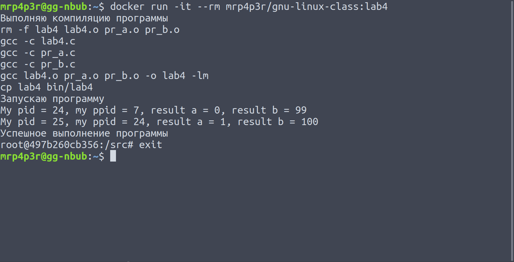

Лабораторная работа #4
======================

Цели работы:

1. Приобретение навыков по управлению процессами.
2. Изучение системного вызова fork().
3. Приобретение навыков написания и трансляции системного ПО на языке C.
4. Изучение утилиты make и ее использование для трансляции программ на языке C.
5. Использование удаленных серверов для трансляции приложений.

Выполнение
==========

В работе была исследована возможность использования контейнеров Docker
для сборки и запуска программ.

Заранее были подготовлены (и откорректированы) `исходные файлы
<https://github.com/MrP4p3r/gnu-linux-class/tree/master/lab4/src>`_
программы.

Для выполнения работы был написан Dockerfile и bash скрипт (lab4.sh).

Dockerfile:

.. include:: ../lab4/Dockerfile
    :literal:

lab4.sh:

.. include:: ../lab4/lab4.sh
    :literal:

Из Dockerfile видно, что:
- На этапе построения контейнера:
    - Исходные файлы программы помещаются в директорию `/src/` внутри контейнера;
    - Скрипт помещается в корневую директорию внутри контейнера;
- После запуска контейнера:
    - Запускается написанный скрипт;
    - После запускается интерпретатор bash;

Рекомендуемая команда для запуска контейнера:

.. code-block:: bash
    docker run -ti --rm mrp4p3r/gnu-linux-class:lab4

После выполнения приведенной команды в терминале можно увидеть:

Вывод
=====

Docker не так сложен в понимании основ работы с ним, как кажется на
первый взгляд.
