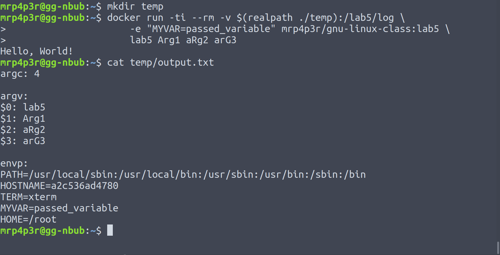

.. _lab4:

======================
Лабораторная работа #5
======================

Цель работы
===========

Изучение системных вызовов для работы с файлами и переменными окружения.

Задание
=======

Написать программу, которая сохраняет значения аргументов командной строки и параметров окружающей среды в файл.

Выполнение
==========

Для компиляции написанной программы был использован контейнер.
Контейнер строится с использованием Dockerfile:

.. include:: ../lab5/Dockerfile
    :literal:

`Исходные файлы
<https://github.com/MrP4p3r/gnu-linux-class/tree/master/lab5/src>`_
программы в процессе построения образа контейнера помещаются в файловую
систему образа, производится ее сборка и установка.

Программа сохраняет значения аргументов командной строки и параметров окружающей
среды в файл /lab5/log/output.txt. Чтобы увидеть его содержимое после запуска контейнера необходимо создать дополнительную директорию на хост системе:

.. code-block:: bash

    mkdir ./temp

А после смонтировать эту директорию как том внутри контейнера с помощью
флага ``-v``. Запустим контейнер следующей командой:

.. code-block:: bash

    docker run -ti --rm -v $(realpath ./temp):/lab5/log \
        -e "MYVAR=passed_variable" mrp4p3r/gnu-linux-class:lab5 \
        lab5 Arg1 aRg2 arG3

Дополнительно в контейнер была передана переменная среды
``MYVAR=passed_variable``. Мы должны ее увидеть в ``output.txt``:

.. code-block:: bash

    cat ./temp/output.txt

Вывод
=====

Переменные среды контейнера не связаны с переменными среды хост-системы.
