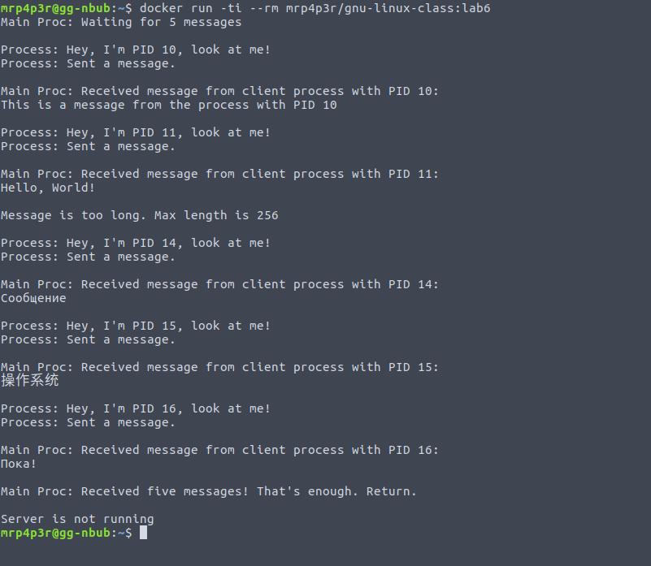
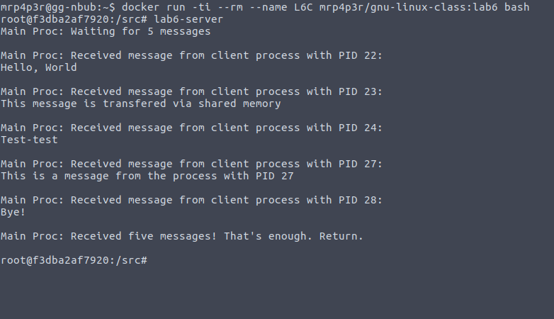
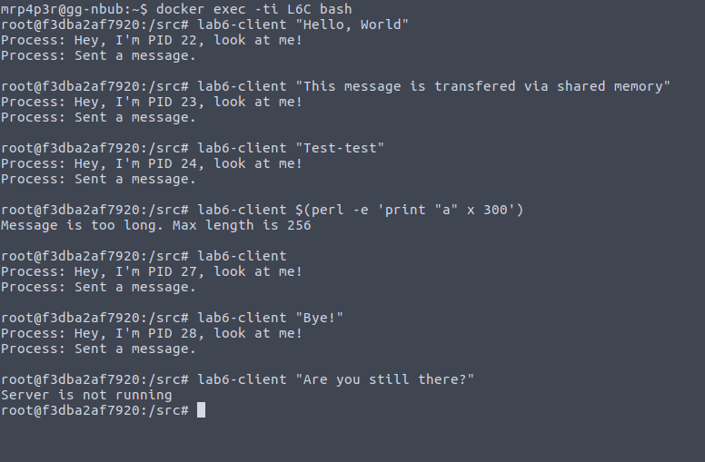

.. _lab6:

======================
Лабораторная работа #6
======================

Цель работы
===========

Изучение системных вызовов для обмена данными между процессами.

Задание
=======

Написать программу для обмена текстовыми сообщениями между процессами,
с использованием механизма разделяемой памяти. Обеспечить синхронизацию
обмена с помощью механизма семафоров.

Выполнение
==========

Для компиляции написанной программы был использован контейнер.
Контейнер строится с использованием Dockerfile:

.. include:: ../lab6/Dockerfile
    :literal:

`Исходные файлы
<https://github.com/MrP4p3r/gnu-linux-class/tree/master/lab6/src>`_
программы в процессе построения образа контейнера помещаются в файловую
систему образа, производится ее сборка и установка.

Для демонстрации работы программы контейнер можно использовать двумя способами.
Первый способ:

.. code-block:: bash

    docker run -ti --rm mrp4p3r/gnu-linux-class:lab6

Этот способ запустит на исполнение следующий скрипт:

.. include:: ../lab6/lab6.sh
    :literal:

Скрипт запускает программу-сервер ``lab6-server`` и несколько раз отправляет
сообщения серверу с помощью утилиты ``lab6-client``. Сервер останавливает свое
выполнение после получения пяти сообщений. После остановки сервера можно видеть
уведомление от lab6-client о том, что сервер не запущен.

Второй способ требует два запущенных терминала. В первом необходимо выполнить:

.. code-block:: bash

    # На хост системе
    docker run -ti --rm --name L6C mrp4p3r/gnu-linux-class:lab6 bash

    # В запущенном контейнере:
    lab6-server

Затем во втором терминале:

.. code-block:: bash

    # На хост системе
    docker exec -ti L6C bash

    # В запущенном контейнере
    lab6-client "Сообщенечка"

И так далее. Все будет выглядеть как на рисунках ниже. Первый терминал:

Второй терминал

Вывод
=====

Понять принципы работы с разделяемой памятью было намного проще,
чем понять идеалогию Docker.

Чтобы нормально (нормально -- для дела, а не побаловаться)
использовать механизм разделяемой памяти, по-хорошему, стоит применять
какую-либо высокоуровневую библиотеку, а не низкоуровневые функции ядра.
